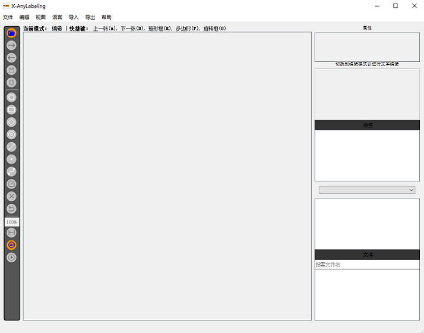
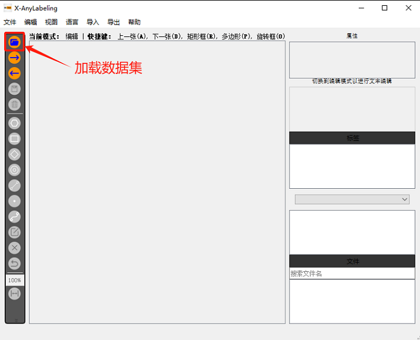
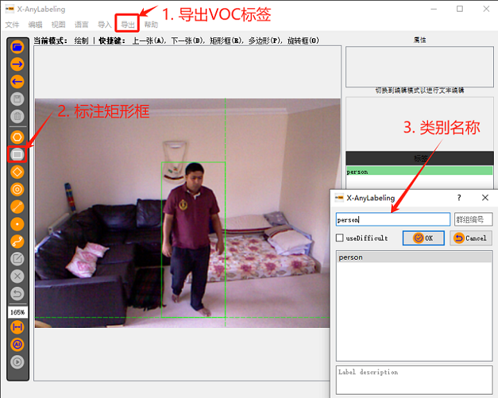

# EdgeAI-Pipeline
🔥🔥运、管、边、端完整解决方案，涵盖了边缘机器视觉计算设备和云端控制中台🔥🔥

## 数据标注
本仓库提供了四个版本的数据标注软件，分别适用于不同的硬件环境和操作系统。  
参考：https://github.com/CVHub520/X-AnyLabeling/releases

| 软件名称                | 硬件要求      | 操作系统     |
|-------------------------|--------------|--------------|
| [X-AnyLabeling-CPU.exe](https://github.com/CVHub520/X-AnyLabeling/releases/download/v2.2.0/X-AnyLabeling-CPU.exe)   | CPU支持       | Windows      |
| [X-AnyLabeling-GPU.exe](https://github.com/CVHub520/X-AnyLabeling/releases/download/v2.2.0/X-AnyLabeling-GPU.exe)   | GPU支持       | Windows      |
| [X-Anylabeling-Linux-CPU](https://github.com/CVHub520/X-AnyLabeling/releases/download/v2.2.0/X-Anylabeling-Linux-CPU) | CPU支持       | Linux        |
| [X-Anylabeling-Linux-GPU](https://github.com/CVHub520/X-AnyLabeling/releases/download/v2.2.0/X-Anylabeling-Linux-GPU) | GPU支持       | Linux        |

### 使用方法
#### 目标检测
1. 下载并解压缩 `X-AnyLabeling-CPU.exe` 到本地环境。
2. 双击运行 `X-AnyLabeling-CPU.exe`。

 

3. 在界面中加载数据集。

 

4. 使用标注工具进行标注。

 

5. Annotations文件夹下保存了xml标注文件