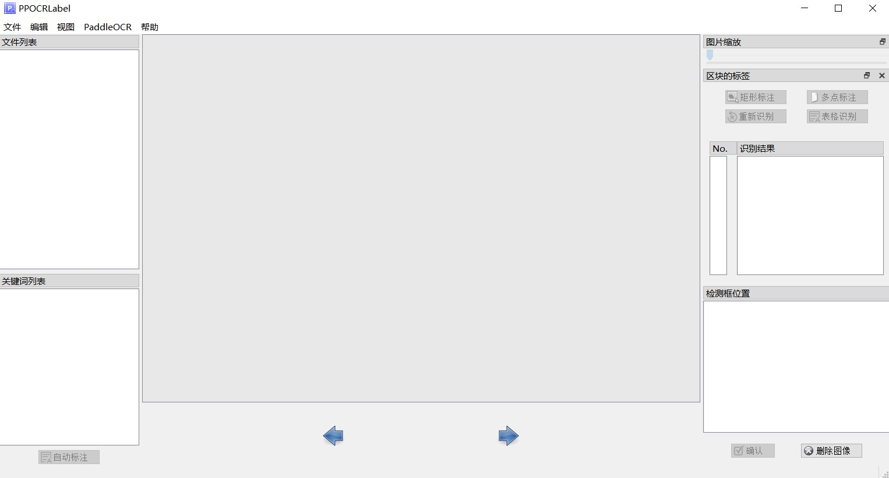

# EdgeAI-Pipeline
运、管、边、端完整解决方案，涵盖了边缘机器视觉计算设备和云端控制中台

## 数据标注
### 目标检测
本仓库提供了四个版本的数据标注软件，分别适用于不同的硬件环境和操作系统。  
参考：https://github.com/CVHub520/X-AnyLabeling/releases

| 软件名称                | 硬件要求      | 操作系统     |
|-------------------------|--------------|--------------|
| [X-AnyLabeling-CPU.exe](https://github.com/CVHub520/X-AnyLabeling/releases/download/v2.3.1/X-AnyLabeling-CPU.exe)   | CPU支持       | Windows      |
| [X-AnyLabeling-GPU.exe](https://github.com/CVHub520/X-AnyLabeling/releases/download/v2.3.1/X-AnyLabeling-GPU.exe)   | GPU支持       | Windows      |
| [X-Anylabeling-Linux-CPU](https://github.com/CVHub520/X-AnyLabeling/releases/download/v2.3.1/X-Anylabeling-Linux-CPU) | CPU支持       | Linux        |
| [X-Anylabeling-Linux-GPU](https://github.com/CVHub520/X-AnyLabeling/releases/download/v2.3.1/X-Anylabeling-Linux-GPU) | GPU支持       | Linux        |

#### 使用方法
1. 下载 `X-AnyLabeling-CPU.exe` 到本地环境。
2. 双击运行 `X-AnyLabeling-CPU.exe`。

 

3. 在界面中加载数据集。

 

4. 使用标注工具进行标注。

 

5. Annotations文件夹下保存了xml标注文件

### 字符识别
本仓库提供了数据标注软件安装流程，适用于Windows操作系统。
软件名称                | 硬件要求      | 操作系统     |
|-------------------------|--------------|--------------|
| [Miniconda3-latest-Windows-x86_64.exe](tools/Miniconda3-latest-Windows-x86_64.exe)   | CPU支持       | Windows      |

#### 使用方法
1. 下载 `Miniconda3-latest-Windows-x86_64.exe` 到本地环境。
2. 安装 `Miniconda3-latest-Windows-x86_64.exe`。
3. 打开 `Anaconda Prompt`，执行以下命令：
- conda create -n ocr python=3.9
- conda activate ocr
- pip3 install --upgrade pip
- python3 -m pip install paddlepaddle -i https://mirror.baidu.com/pypi/simple
- pip install PPOCRLabel  -i https://pypi.tuna.tsinghua.edu.cn/simple
- PPOCRLabel --lang ch --kie True

 

#### 操作步骤
1. 安装与运行：使用上述命令安装与运行程序。
2. 打开文件夹：在菜单栏点击 “文件” - "打开目录" 选择待标记图片的文件夹.
3. 自动标注：点击 “自动标注”，使用PP-OCR超轻量模型对图片文件名前图片状态为 “X” 的图片进行自动标注。
4. 手动标注：点击 “矩形标注”（推荐直接在英文模式下点击键盘中的 “W”)，用户可对当前图片中模型未检出的部分进行手动绘制标记框。点击键盘Q，则使用四点标注模式（或点击“编辑” - “四点标注”），用户依次点击4个点后，双击左键表示标注完成。
5. 标记框绘制完成后，用户点击 “确认”，检测框会先被预分配一个 “待识别” 标签。
6. 重新识别：将图片中的所有检测画绘制/调整完成后，点击 “重新识别”，PP-OCR模型会对当前图片中的所有检测框重新识别。
7. 内容更改：单击识别结果，对不准确的识别结果进行手动更改。
8. 确认标记：点击 “确认”，图片状态切换为 “√”，跳转至下一张。
9. 删除：点击 “删除图像”，图片将会被删除至回收站。
10. 导出结果：用户可以通过菜单中“文件-导出标记结果”手动导出，同时也可以点击“文件 - 自动导出标记结果”开启自动导出。手动确认过的标记将会被存放在所打开图片文件夹下的Label.txt中。在菜单栏点击 “文件” - “导出识别结果”后，会将此类图片的识别训练数据保存在crop_img文件夹下，识别标签保存在rec_gt.txt中。

#### 注意
1. 产生的文件放置于标记图片文件夹下，包括以下几种，请勿手动更改其中内容，否则会引起程序出现异常。

文件名                        | 说明      |      
|----------------------------|-----------------|
| Label.txt     | 检测标签，可直接用于PPOCR检测模型训练。用户每确认5张检测结果后，程序会进行自动写入。当用户关闭应用程序或切换文件路径后同样会进行写入      |
| fileState.txt | 图片状态标记文件，保存当前文件夹下已经被用户手动确认过的图片名称 |
| Cache.cach	| 缓存文件，保存模型自动识别的结果 |
| rec_gt.txt	| 识别标签。可直接用于PPOCR识别模型训练。需用户手动点击菜单栏“文件” - “导出识别结果”后产生  |
| crop_img	    | 识别数据。按照检测框切割后的图片。与rec_gt.txt同时产生 |

#### 导出标记结果
1. 自动导出：点击“文件 - 自动导出标记结果”后，用户每确认过一张图片，程序自动将标记结果写入Label.txt中。若未开启此选项，则检测到用户手动确认过5张图片后进行自动导出。默认情况下自动导出功能为关闭状态。
2. 手动导出：点击“文件 - 导出标记结果”手动导出标记。
3. 关闭应用程序导出。

